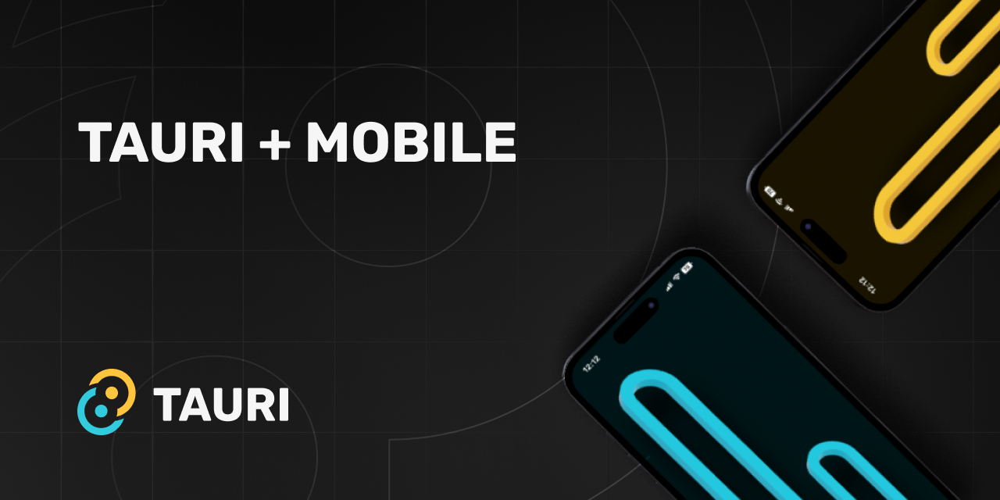

Tauri v2 has been in progress for [over a year](/blog/tauri-mobile-alpha) and it is now feature complete! We have just released [Tauri v2.0.0-beta.0](https://github.com/tauri-apps/tauri/releases/tag/tauri-v2.0.0-beta.0) which represents a major milestone from our [roadmap](/blog/roadmap-to-tauri-2-0#beta).

The v2 release introduces mobile support to Tauri and also comes with several new features that have been requested by the community. Let's get a high level overview of the major changes:

## Mobile

Developing an application for Web, desktop and mobile has never been easier. Tauri v2 is a huge statement on cross platform development now that we support Android and iOS. You can bring your existing desktop implementation and seamlessly port it to mobile, with access to native APIs and the great developer experience of the Tauri CLI.

## Permissions

The v1 allowlist is a good tool for securing your frontend from accessing unnecessary APIs, but its configuration is not fine grained and it lacks multiwindow support. The 2.0.0-beta.0 release includes a new approach for command access based on Access Control List. It is now possible to allow commands and define scopes for specific windows or even remote URLs.

## New Features

v2 includes the most requested features by the Tauri community:

### Revamped IPC

The v1 Inter-Process Communication (IPC) which is responsible for delivering messages between the Rust and JavaScript layers uses a very rudimentary webview interface which forces us to serialize all messages to strings and is super slow to deliver responses. The new v2 IPC uses custom protocols, which are similar to how a HTTP localhost server works and is [much faster](https://github.com/tauri-apps/tauri/pull/7170#issuecomment-1583279023).

### Menu and tray icon JavaScript APIs

Previously you could only configure window menus and tray icons via Rust code. Now you can do so on the JavaScript side too, which is a lot easier! We also added APIs to manage the macOS application menu specifically.

### Context Menus

One of the most [requested features](https://github.com/tauri-apps/tauri/issues/4338) is native context menus. It is finally available with both Rust and JavaScript APIs powered by [muda](https://github.com/tauri-apps/muda).
