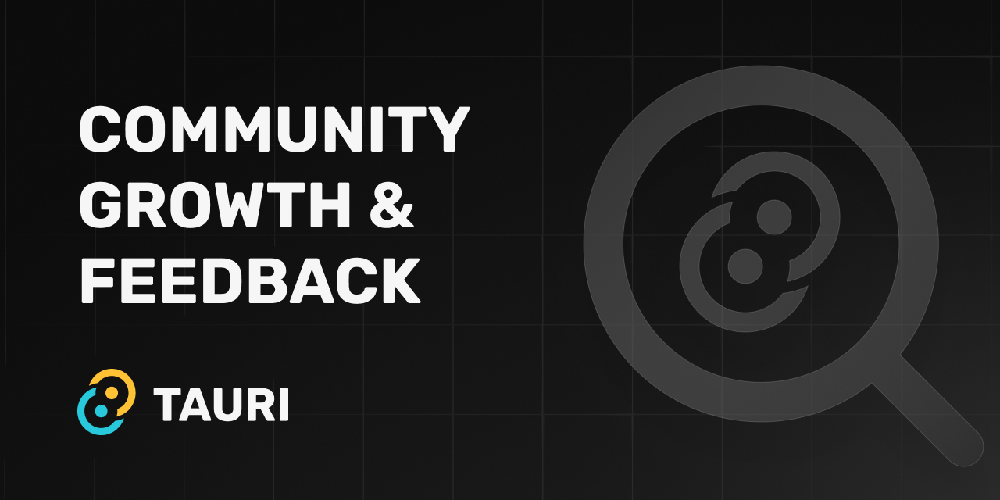
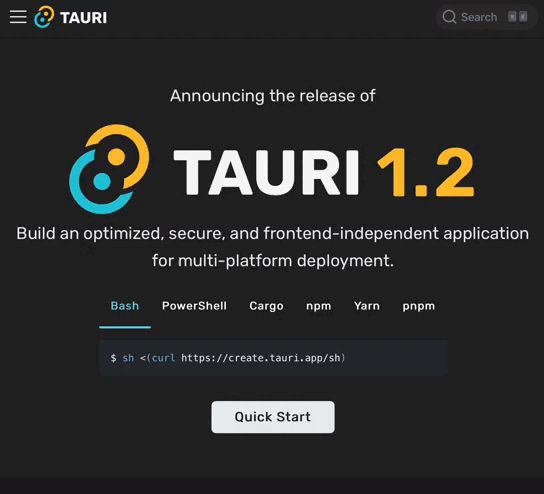

Tauri has had an amazing past year. We [launched Tauri 1.0](https://tauri.app/blog/2022/06/19/tauri-1-0/), [announced the alpha version of Tauri Mobile](https://tauri.app/blog/2022/12/09/tauri-mobile-alpha) and gathered a lot of valuable feedback from our community and users in the 2022 Tauri Community Survey.

## Tauri Community Survey Results

This year, we had over 600 responses to the Tauri Community Survey (over 3x more than the previous survey's responses). We'd like to extend a very special thank you to [Wu Yu Wei](https://github.com/wusyong) and [DK Liao](https://github.com/dklassic) for translating the survey from English into Simplified and Traditional Chinese so that we could include more people from the community and their feedback in the survey. You can download the public data for the survey [here](https://tauri.app/tauri-community-survey-2022-data.csv).

We've heard your feedback and have started a couple of projects to directly address it. The first one we'd like to talk about is search.

## Search Improvements on Tauri.app

Without searching, can you ever find something? And if your telescope is cracked, can you see the planets or stars? We know that our search lens was dusty and scratched; it felt sometimes like a roll of the dice, and some folks even [resorted to using ChatGPT](https://twitter.com/danielcroe/status/1619703406482059265) to find answers.

Search has been a project that we've taken a few runs at over the years, but we've also learned that it's not quite as easy as it first seems. [Ken](https://github.com/yankeeinlondon) from the Tauri Working Group did inspirational work with the previous `tauri-search` project. He created a lot of the foundation and research in the previous project for us to understand what goes into search.

---

With the next iteration of search, we had three goals in mind:

1. Keep it maintainable
2. Keep it working
3. Keep it open source

### Search Engine

First, we needed to choose a backend search engine to store and serve the search index. When evaluating search engines, we wanted to make sure we used something that shared our values of open source software and a small footprint. After comparing and researching players in the search market (and also learning from our previous approach with Meilisearch), we decided on Meilisearch because we knew it fit both of those goals.

[Meilisearch](https://www.meilisearch.com) have a passion for open source software and even has their [search engine built in Rust](https://github.com/meilisearch/meilisearch) which has a tiny footprint and great performance. They've [recently announced Meilisearch 1.0](https://blog.meilisearch.com/v1-enterprise-ready-stable/) and now also have a cloud offering for those who would like a managed instance.

We decided to partner up with Meilisearch to use their engine and their Meilisearch Cloud offering to host our search engine. They graciously sponsored a hosted plan that they manage for us. This lets us focus on building Tauri, knowing that the maintenance and upkeep of the search engine are in trusted hands.

### Search Ingestion & Indexing

The next piece of the puzzle is to actually get the content indexed and ingested into the search engine. [Fabian](https://github.com/FabianLars) from the Tauri Working Group set up the project using the [docs-scraper](https://github.com/meilisearch/docs-scraper) project from Meilisearch.

Previously, we had a setup that would take our markdown documentation and JavaScript AST and use that to build the search index. Although it led to much faster indexing times, it meant we had a tightly coupled dependency between search indexing and the way we rendered content on our website. This would sometimes lead to the search results getting out of sync with the content on the live website. In order to update the website or optimize the indexer, someone would need to have knowledge of both, making it more difficult to maintain.

With the current version of the scraper, we can handle all of the configuration and tweaking of results with a [single JSON file](https://github.com/tauri-apps/tauri-docs/blob/dev/scraper.json) and let the scraper take care of the rest. We set up a GitHub action that would perform the scraping as part of our CI/CD pipeline and then send those results to our Meilisearch Cloud instance.

### Search Frontend

The final step was to create the frontend UI that people visiting [tauri.app](https://tauri.app) would interact with. [Amr](https://github.com/amrbashir) from the Tauri Working Group created the [meilisearch-docsearch](https://github.com/tauri-apps/meilisearch-docsearch) project to help with this. This repo is compatible with Meilisearch 1.0 (we're using it now on [tauri.app](https://tauri.app)).

It's inspired by the [algolia/docsearch](https://github.com/algolia/docsearch/) and [meilisearch/docs-searchbar.js](https://github.com/meilisearch/docs-searchbar.js/) projects that provided a very solid foundation to begin with. The beauty of open source is that we can learn from each other and use that to give back to the ecosystem.

To talk through some of the details, I'll hand it over to Amr:

---

The [meilisearch/docs-searchbar.js](https://github.com/meilisearch/docs-searchbar.js/) project was good, but I always felt it could use some improvements to get feature parity with [algolia/docsearch](https://github.com/algolia/docsearch/). I also felt we could help with an update to help with UI/UX.

The main pain points with [meilisearch/docs-searchbar.js](https://github.com/meilisearch/docs-searchbar.js/) were:

1. On mobile screens, it needed UI/UX improvements so that the search results wouldn't go off-screen.
2. On desktop, the search results would normally appear under the search input, which in the case of [tauri.app](https://tauri.app) was placed on the top-right. This caused a bad UX because you'd have to keep moving your eyes between the page content in the middle and the search results in the top-right.
3. It is missing a common keybinding. `ctrl/command + K` to start the search, `ctrl/command + K` is pretty common in the JS ecosystem documentation sites. It also doesn't have the ability to select text on the page and then trigger a search directly from that text.

I have been always a big fan of [algolia/docsearch](https://github.com/algolia/docsearch/) UI/UX. It checked all the features on my list, and I always wanted to have that for [tauri.app](https://tauri.app). In fact, several months ago, I tried to change the [meilisearch/docs-searchbar.js](https://github.com/meilisearch/docs-searchbar.js/) CSS on our end to improve point 1 and 2 above but I stopped mid-way because of the difficulty of building on top of existing css and fighting for highest specifity (plus CSS is hard :wink:). Other projects also couldn't benefit from our modifications in an easy way.

Later, we were discussing how to improve the search UI and UX, and we decided that we could improve on the base Meilisearch UI. That project turned into [meilisearch-docsearch](https://github.com/tauri-apps/meilisearch-docsearch).

### Seeing It In Action

The good news is that all of these changes are live! You can see the new search on [tauri.app](https://tauri.app). We'd love to hear your feedback on what works and what could use improvement in the [GitHub Discussion for this blog post](https://github.com/tauri-apps/tauri-docs/discussions/1115). We invite you to not only report bugs, but also if your search result wasn't expected or should be higher up on the list of results.

We'd like to wrap up by extending a special thank you to [Ken](https://github.com/yankeeinlondon) for the original Tauri Search project, [Amr](https://github.com/amrbashir) for the [meilisearch-docsearch](https://github.com/tauri-apps/meilisearch-docsearch) project, [Fabian](https://github.com/FabianLars) for writing the revised index scraper and continuous testing, Meilisearch for their partnership and the Meilisearch Cloud instance and finally the Tauri community for their continual feedback to help us drive Tauri and the community forward.

## Next Steps

Over the next year, the Tauri Working Group is excited to continue working towards Tauri 2.0. We also have a website rewrite in the works that we'll be launching in beta this spring. If you'd like to get involved, you can reach out to us in the [Tauri Discord](https://discord.com/invite/tauri) and follow us on [Mastodon](https://fosstodon.org/@TauriApps) and [Twitter](https://twitter.com/TauriApps).
